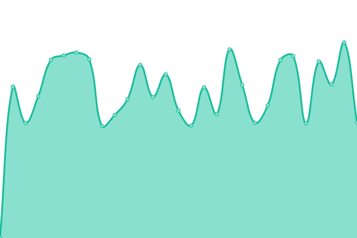
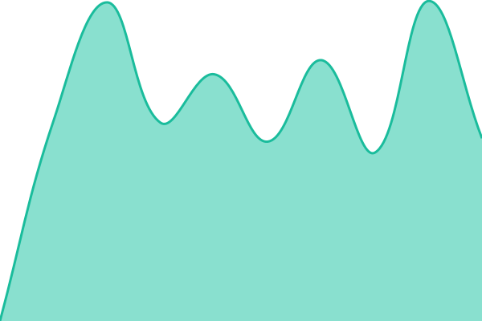
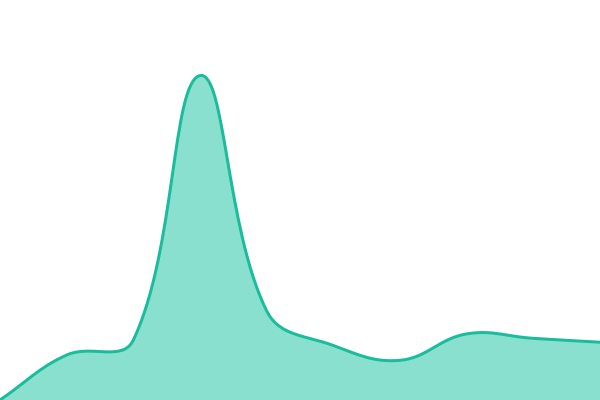
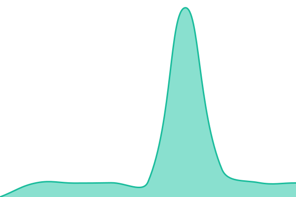
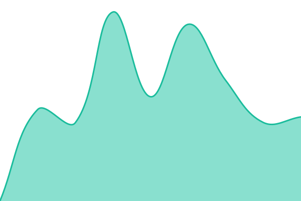
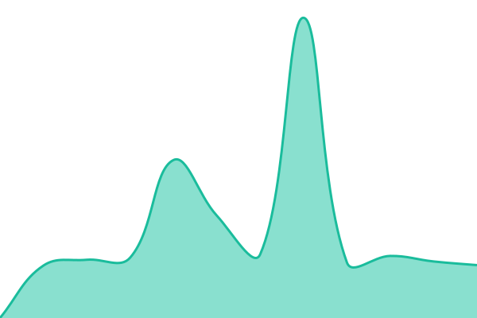

# [📈 Live Status](https://DSITD-Universitas-Hasanuddin.github.io/uptime-checker): <!--live status--> **🟧 Partial outage**

This repository contains the open-source uptime monitor and status page for [DSITD Universitas Hasanuddin](https://dsitd.unhas.ac.id), powered by [Upptime](https://github.com/upptime/upptime).

With [Upptime](https://upptime.js.org), you can get your own unlimited and free uptime monitor and status page, powered entirely by a GitHub repository. We use [Issues](https://github.com/DSITD-Universitas-Hasanuddin/uptime-checker/issues) as incident reports, [Actions](https://github.com/DSITD-Universitas-Hasanuddin/uptime-checker/actions) as uptime monitors, and [Pages](https://DSITD-Universitas-Hasanuddin.github.io/uptime-checker) for the status page.

<!--start: status pages-->
<!-- This summary is generated by Upptime (https://github.com/upptime/upptime) -->
<!-- Do not edit this manually, your changes will be overwritten -->
<!-- prettier-ignore -->
| URL | Status | History | Response Time | Uptime |
| --- | ------ | ------- | ------------- | ------ |
|  [Unhas Main](https://unhas.ac.id) | 🟩 Up | [unhas-main.yml](https://github.com/DSITD-Universitas-Hasanuddin/uptime-checker/commits/HEAD/history/unhas-main.yml) | 

 6229ms
     
 | 

<a href="https://DSITD-Universitas-Hasanuddin.github.io/uptime-checker/history/unhas-main">97.34%</a>
    

|  [Apps](https://apps.unhas.ac.id) | 🟩 Up | [apps.yml](https://github.com/DSITD-Universitas-Hasanuddin/uptime-checker/commits/HEAD/history/apps.yml) | 

 4735ms
     
 | 

<a href="https://DSITD-Universitas-Hasanuddin.github.io/uptime-checker/history/apps">97.77%</a>
    

|  [Neosia](https://neosia.unhas.ac.id) | 🟩 Up | [neosia.yml](https://github.com/DSITD-Universitas-Hasanuddin/uptime-checker/commits/HEAD/history/neosia.yml) | 

 746ms
     
 | 

<a href="https://DSITD-Universitas-Hasanuddin.github.io/uptime-checker/history/neosia">100.00%</a>
    

|  [SSO Unhas](https://sso.unhas.ac.id) | 🟩 Up | [sso-unhas.yml](https://github.com/DSITD-Universitas-Hasanuddin/uptime-checker/commits/HEAD/history/sso-unhas.yml) | 

 1539ms
     
 | 

<a href="https://DSITD-Universitas-Hasanuddin.github.io/uptime-checker/history/sso-unhas">97.82%</a>
    

|  [Sikola Unhas](https://sikola.unhas.ac.id) | 🟥 Down | [sikola-unhas.yml](https://github.com/DSITD-Universitas-Hasanuddin/uptime-checker/commits/HEAD/history/sikola-unhas.yml) | 

 0ms
     
 | 

<a href="https://DSITD-Universitas-Hasanuddin.github.io/uptime-checker/history/sikola-unhas">0.00%</a>
    

|  [Dikmawa](https://dikmawa.unhas.ac.id) | 🟩 Up | [dikmawa.yml](https://github.com/DSITD-Universitas-Hasanuddin/uptime-checker/commits/HEAD/history/dikmawa.yml) | 

 2713ms
     
 | 

<a href="https://DSITD-Universitas-Hasanuddin.github.io/uptime-checker/history/dikmawa">69.35%</a>
    

|  [Sister Unhas](http://sister.unhas.ac.id) | 🟥 Down | [sister-unhas.yml](https://github.com/DSITD-Universitas-Hasanuddin/uptime-checker/commits/HEAD/history/sister-unhas.yml) | 

 0ms
     
 | 

<a href="https://DSITD-Universitas-Hasanuddin.github.io/uptime-checker/history/sister-unhas">0.00%</a>
    

|  [Fakultas Kedokteran](https://med.unhas.ac.id) | 🟩 Up | [fakultas-kedokteran.yml](https://github.com/DSITD-Universitas-Hasanuddin/uptime-checker/commits/HEAD/history/fakultas-kedokteran.yml) | 

 3204ms
     
 | 

<a href="https://DSITD-Universitas-Hasanuddin.github.io/uptime-checker/history/fakultas-kedokteran">97.92%</a>
    

|  [Fakultas Ekonomi](https://feb.unhas.ac.id) | 🟩 Up | [fakultas-ekonomi.yml](https://github.com/DSITD-Universitas-Hasanuddin/uptime-checker/commits/HEAD/history/fakultas-ekonomi.yml) | 

 3226ms
     
 | 

<a href="https://DSITD-Universitas-Hasanuddin.github.io/uptime-checker/history/fakultas-ekonomi">97.96%</a>
    

|  [Fakultas IKP](https://fikp.unhas.ac.id) | 🟩 Up | [fakultas-ikp.yml](https://github.com/DSITD-Universitas-Hasanuddin/uptime-checker/commits/HEAD/history/fakultas-ikp.yml) | 

 2754ms
     
 | 

<a href="https://DSITD-Universitas-Hasanuddin.github.io/uptime-checker/history/fakultas-ikp">98.01%</a>
    

|  [Fakultas KM](https://fkm.unhas.ac.id) | 🟩 Up | [fakultas-km.yml](https://github.com/DSITD-Universitas-Hasanuddin/uptime-checker/commits/HEAD/history/fakultas-km.yml) | 

 2687ms
     
 | 

<a href="https://DSITD-Universitas-Hasanuddin.github.io/uptime-checker/history/fakultas-km">98.06%</a>
    

|  [Fakultas Farmasi](https://farmasi.unhas.ac.id) | 🟩 Up | [fakultas-farmasi.yml](https://github.com/DSITD-Universitas-Hasanuddin/uptime-checker/commits/HEAD/history/fakultas-farmasi.yml) | 

 2394ms
     
 | 

<a href="https://DSITD-Universitas-Hasanuddin.github.io/uptime-checker/history/fakultas-farmasi">98.11%</a>
    

|  [Fakultas Ilmu Budaya](https://ilmubudaya.unhas.ac.id) | 🟥 Down | [fakultas-ilmu-budaya.yml](https://github.com/DSITD-Universitas-Hasanuddin/uptime-checker/commits/HEAD/history/fakultas-ilmu-budaya.yml) | 

 0ms
     
 | 

<a href="https://DSITD-Universitas-Hasanuddin.github.io/uptime-checker/history/fakultas-ilmu-budaya">0.00%</a>
    

|  [Fakultas ISIP](https://fisip.unhas.ac.id) | 🟩 Up | [fakultas-isip.yml](https://github.com/DSITD-Universitas-Hasanuddin/uptime-checker/commits/HEAD/history/fakultas-isip.yml) | 

 2547ms
     
 | 

<a href="https://DSITD-Universitas-Hasanuddin.github.io/uptime-checker/history/fakultas-isip">70.58%</a>
    

|  [Fakultas Pertanian](https://agriculture.unhas.ac.id) | 🟩 Up | [fakultas-pertanian.yml](https://github.com/DSITD-Universitas-Hasanuddin/uptime-checker/commits/HEAD/history/fakultas-pertanian.yml) | 

 2821ms
     
 | 

<a href="https://DSITD-Universitas-Hasanuddin.github.io/uptime-checker/history/fakultas-pertanian">68.63%</a>
    

|  [Fakultas Peternakan](https://peternakan.unhas.ac.id) | 🟩 Up | [fakultas-peternakan.yml](https://github.com/DSITD-Universitas-Hasanuddin/uptime-checker/commits/HEAD/history/fakultas-peternakan.yml) | 

 2615ms
     
 | 

<a href="https://DSITD-Universitas-Hasanuddin.github.io/uptime-checker/history/fakultas-peternakan">98.25%</a>
    

|  [Fakultas Kehutanan](https://forestry.unhas.ac.id) | 🟩 Up | [fakultas-kehutanan.yml](https://github.com/DSITD-Universitas-Hasanuddin/uptime-checker/commits/HEAD/history/fakultas-kehutanan.yml) | 

 3058ms
     
 | 

<a href="https://DSITD-Universitas-Hasanuddin.github.io/uptime-checker/history/fakultas-kehutanan">98.30%</a>
    

|  [Fakultas Hukum](https://lawfaculty.unhas.ac.id) | 🟩 Up | [fakultas-hukum.yml](https://github.com/DSITD-Universitas-Hasanuddin/uptime-checker/commits/HEAD/history/fakultas-hukum.yml) | 

 1673ms
     
 | 

<a href="https://DSITD-Universitas-Hasanuddin.github.io/uptime-checker/history/fakultas-hukum">98.34%</a>
    

|  [Fakultas Kedokteran Gigi](https://dent.unhas.ac.id) | 🟩 Up | [fakultas-kedokteran-gigi.yml](https://github.com/DSITD-Universitas-Hasanuddin/uptime-checker/commits/HEAD/history/fakultas-kedokteran-gigi.yml) | 

 1095ms
     
 | 

<a href="https://DSITD-Universitas-Hasanuddin.github.io/uptime-checker/history/fakultas-kedokteran-gigi">100.00%</a>
    

|  [Fakultas Vokasi](https://vokasi.unhas.ac.id) | 🟩 Up | [fakultas-vokasi.yml](https://github.com/DSITD-Universitas-Hasanuddin/uptime-checker/commits/HEAD/history/fakultas-vokasi.yml) | 

 3048ms
     
 | 

<a href="https://DSITD-Universitas-Hasanuddin.github.io/uptime-checker/history/fakultas-vokasi">98.39%</a>
    

|  [Fakultas Keperawatan](https://nursing.unhas.ac.id) | 🟩 Up | [fakultas-keperawatan.yml](https://github.com/DSITD-Universitas-Hasanuddin/uptime-checker/commits/HEAD/history/fakultas-keperawatan.yml) | 

 4376ms
     
 | 

<a href="https://DSITD-Universitas-Hasanuddin.github.io/uptime-checker/history/fakultas-keperawatan">98.44%</a>
    

|  [Fakultas MIPA](https://sci.unhas.ac.id) | 🟩 Up | [fakultas-mipa.yml](https://github.com/DSITD-Universitas-Hasanuddin/uptime-checker/commits/HEAD/history/fakultas-mipa.yml) | 

 3529ms
     
 | 

<a href="https://DSITD-Universitas-Hasanuddin.github.io/uptime-checker/history/fakultas-mipa">98.49%</a>
    

|  [Fakultas Teknik2](https://eng.unhas.ac.id/fakultas/) | 🟥 Down | [fakultas-teknik2.yml](https://github.com/DSITD-Universitas-Hasanuddin/uptime-checker/commits/HEAD/history/fakultas-teknik2.yml) | 

 0ms
     
 | 

<a href="https://DSITD-Universitas-Hasanuddin.github.io/uptime-checker/history/fakultas-teknik2">0.00%</a>
    

|  [LP2M](https://lp2m.unhas.ac.id) | 🟩 Up | [lp-2-m.yml](https://github.com/DSITD-Universitas-Hasanuddin/uptime-checker/commits/HEAD/history/lp-2-m.yml) | 

 2683ms
     
 | 

<a href="https://DSITD-Universitas-Hasanuddin.github.io/uptime-checker/history/lp-2-m">98.58%</a>
    

<!--end: status pages-->

[**Visit our status website →**](https://DSITD-Universitas-Hasanuddin.github.io/uptime-checker)

## 📄 License

- Powered by: [Upptime](https://github.com/upptime/upptime)
- Code: [MIT](./LICENSE) © [DSITD Universitas Hasanuddin](https://dsitd.unhas.ac.id)
- Data in the `./history` directory: [Open Database License](https://opendatacommons.org/licenses/odbl/1-0/)
